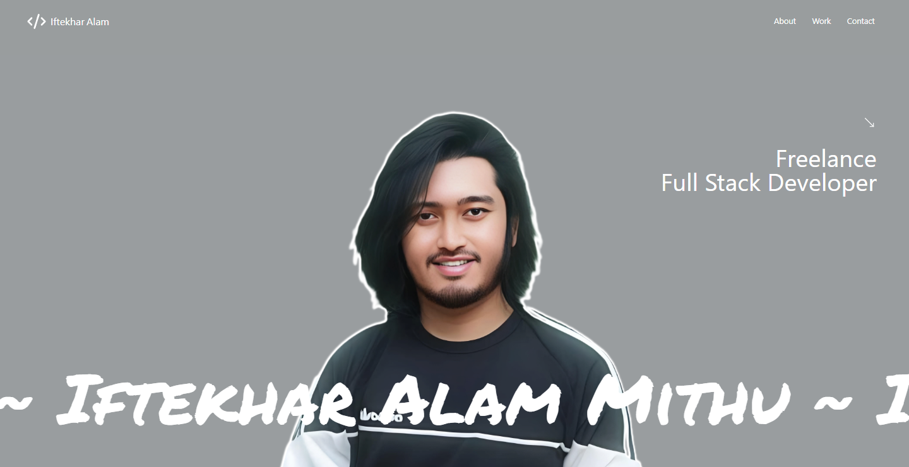

# 🌟 Portfolio Site



## 📖 About This Project

This portfolio site is a modern, responsive web application designed to showcase my work and skills as a developer. It leverages the power of **React** and **Vite** for a fast, efficient development experience, combined with the fluid animations provided by **Framer Motion** to create an engaging user interface.

### ✨ Key Features

- **📱 Responsive Design**: Adapts seamlessly to various screen sizes and devices.
- **🎨 Smooth Animations**: Utilizes Framer Motion for fluid, eye-catching transitions and effects.
- **⚡ Dynamic Content**: Easily updatable sections for projects, skills, and contact information.
- **🚀 Performance Optimized**: Built with Vite for lightning-fast load times and optimal performance.

## 🛠️ Technologies Used

- **React**
- **Vite**
- **Framer Motion**
- **Tailwind CSS**
- **React Router**
- **Styled Components**

## 🚀 Getting Started

To run this project locally:

1. **Clone the repository**:

   ```bash
   git clone https://github.com/iftekharalammithu/Portfolio-Site.git

   ```

2. Install dependencies:
   ```bash
   npm install
   ```
3. Start the development server:
   ```bash
   npm start
   ```

<br/>
<br/>
<br/>

Follow on social media:

[
](https://x.com/M1thuChowdhury)
[
](https://www.linkedin.com/in/iftekharalammithu/)
[
](https://www.instagram.com/iftekharalammithu/)

<div style="text-align: center;">
  <a href="https://www.buymeacoffee.com/iftekharalammithu">
    
  </a>
</div>
